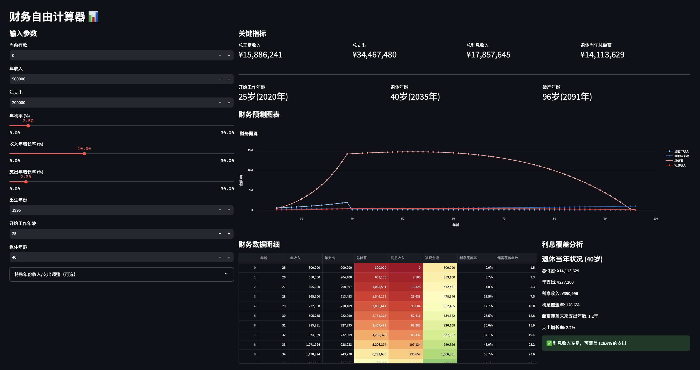

# 提前退休(FIRE)计算器 📊

## 示例页面展示



一个基于收入、支出和投资的财务规划工具，帮助用户进行长期财务规。

思路源于[FIRE(Financial Independence, Retire Early)](https://zh.wikipedia.org/zh-cn/FIRE运动)，大部分代码由ChatGPT和Cursor生成

## 功能特点

- 📈 可视化财务预测
- 💰 退休储蓄计算
- 📊 利息收入分析
- 🎯 储蓄覆盖年限预测
- 💹 通胀因素考虑
- 🎆 特殊年份收入或支出
- 📅 退休情况预览


## Quick Start
有两种方法：
1. 本地部署 Deploy locally
```bash
streamlit run web.py  
```

2. [已部署的宝塔应用](https://kevintsok-fire-calculator-web-0ab5gb.streamlit.app)

ps：因为暂不想host一个服务器，所以用了宝塔的免费服务器。有时程序会因为长期未使用会进入休眠，需要重新启动

## 输入参数说明

- **当前存款**：目前的储蓄总额
- **年收入**：当前年度总收入
- **年支出**：年度基本支出
- **年利率**：预期投资回报率
- **收入年增长率**：工作收入的预期年增长率，如升值加薪等
- **支出年增长率**：支出的年增长率，例如通胀等
- **出生年份**：用于计算各个时间点的年龄
- **开始年份**：规划开始的年份
- **终止年份**：规划结束的年份
- **退休年份**：预期退休的年份

## 输出分析

应用将生成：
- 关键财务指标展示
- 交互式财务预测图表
- 详细的年度财务数据
- 利息覆盖分析报告


## 技术栈

- Python 3.9+
- Streamlit
- Pandas
- Plotly
- JSON

## 贡献指南

欢迎提交 Issue 和 Pull Request 来帮助改进项目。

## 许可证

MIT License